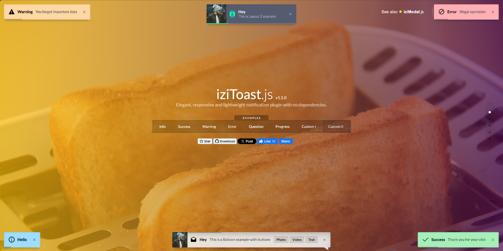

<div align="center">
  
</div>
<p align="center" style="margin-top: 25px">
 Elegant, responsive and lightweight notification plugin with no dependencies.
</p>

<p align="center">
  <a href="https://marcelodolza.github.io/iziToast/"><b>Documentation</b></a>
</p>

# Nuxt Toast

[![npm version][npm-version-src]][npm-version-href]
[![npm downloads][npm-downloads-src]][npm-downloads-href]
[![License][license-src]][license-href]
[![Nuxt][nuxt-src]][nuxt-href]

A Nuxt module for easily integrating [iziToast](https://github.com/marcelodolza/iziToast) notifications into your Nuxt 3 application.

## Features

- 🔔 &nbsp;Easily show toast notifications in your Nuxt 3 app
- 🎨 &nbsp;Customizable styles and icons
- ⚡ &nbsp;Supports auto-imported composable (`useToast()` by default)
- 🔧 &nbsp;Fully configurable via `nuxt.config.ts`
- 🔄 &nbsp;Supports changing the composable name dynamically

## Quick Setup

Install the module to your Nuxt application with one command:

```bash
npx nuxi module add nuxt-toast
```

### **Manual Installation**

If you prefer to install manually, run:

```bash
# Using npm
npm install nuxt-toast

# Using yarn
yarn add nuxt-toast

# Using pnpm
pnpm add nuxt-toast

# Using bun
bun add nuxt-toast
```

Then, add it to your Nuxt config:

```ts
export default defineNuxtConfig({
  modules: [
    'nuxt-toast'
  ]
})
```
## 🚀 Usage

Once installed, you can use `useToast()` anywhere in your Nuxt app:

### **Basic Example**

```vue
<script setup>
const toast = useToast()

toast.success({ title: 'Success!', message: 'Your action was completed successfully.' })
toast.error({ title: 'Error!', message: 'Something went wrong.' })
toast.info({ title: 'Info', message: 'Here is some information.' })
toast.warning({ title: 'Warning!', message: 'Be careful with this action.' })
toast.question({ title: 'Confirmation', message: 'Are you sure you want to continue with this action?' })
</script>
```

### **Customizing Toast Appearance & Options**

```vue
<script setup>
useToast().show({
	title: 'Title',
	message: 'Message',
	timeout: 3000,
	position: 'topCenter',
	layout: 2,
	...options,
})
</script>
```

### **Dynamically Hiding Toasts**

```vue
<script setup>
const toast = useToast()

// Show a toast
toast.error({
	title: 'Error!',
	message: 'An issue occurred.',
	timeout: 30000,
})

// Hide the toast after 5 seconds
setTimeout(() => {
	toast.hideToast('Error!', 'An issue occurred.', 'error')
}, 5000)
</script>
```

### **Customizing the Composable Name**

If you've modified the `composableName` in `nuxt.config.ts`, for example:

```ts
export default defineNuxtConfig({
  toast: { composableName: 'useNotification' }
})
```

Then, use the updated composable name in your component:

```vue
<script setup>
useNotification().success({
  title: 'Success!',
  message: 'You did it!',
})
</script>
```

This ensures consistency with your custom naming convention. 🚀

<!-- Badges -->

[npm-version-src]: https://img.shields.io/npm/v/nuxt-toast/latest.svg?style=flat&colorA=020420&colorB=00DC82
[npm-version-href]: https://npmjs.com/package/nuxt-toast
[npm-downloads-src]: https://img.shields.io/npm/dm/nuxt-toast.svg?style=flat&colorA=020420&colorB=00DC82
[npm-downloads-href]: https://npm.chart.dev/nuxt-toast
[license-src]: https://img.shields.io/npm/l/nuxt-toast.svg?style=flat&colorA=020420&colorB=00DC82
[license-href]: https://npmjs.com/package/nuxt-toast
[nuxt-src]: https://img.shields.io/badge/Nuxt-020420?logo=nuxt.js
[nuxt-href]: https://nuxt.com

